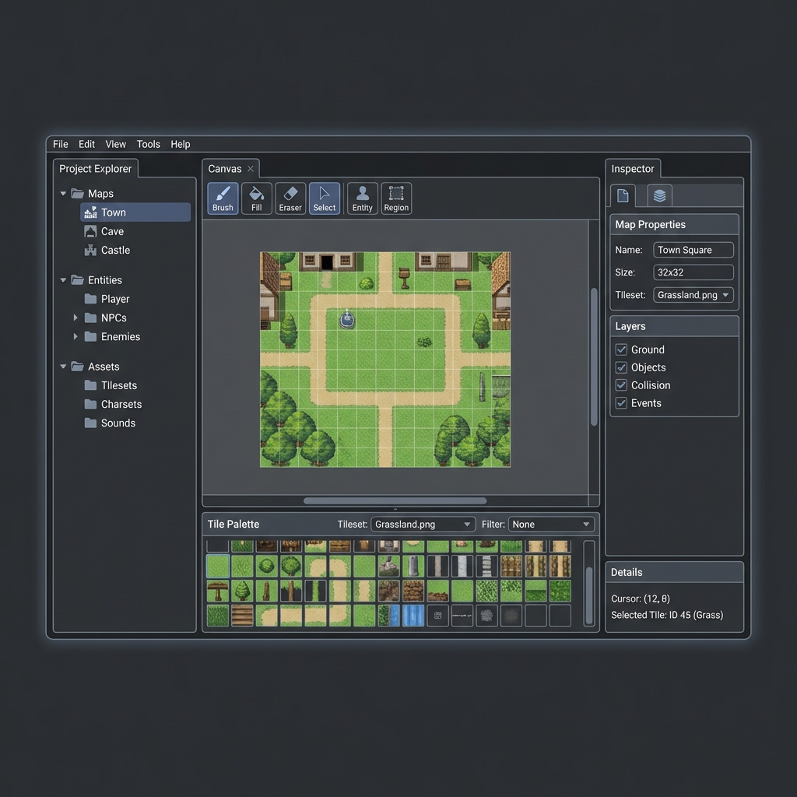

# Wireframe: Editor UI Layout

## Visual Mockup



## Layout Overview

The editor uses a 3-panel layout with the following structure:

### Top Bar
- **Menu Bar**: File, Edit, View, Tools, Help
- **Toolbar**: Drawing tools (Brush, Fill, Eraser, Select, Entity, Region)

### Left Panel: Project Explorer (250px default, 200-400px range)
- **Maps Section**: Hierarchical tree of all maps
- **Entities Section**: Player, NPCs, Enemies subfolders
- **Assets Section**: Tilesets, Charsets, Sounds subfolders

### Center Area
- **Canvas Viewport**: Main editing area with grid overlay
- **Tile Palette** (below canvas, 200px height):
  - Tileset selector dropdown
  - Filter dropdown (All, Grass, Stone, Water, etc.)
  - Grid of tiles (16 columns, scrollable)
  - Selected tile highlighted

### Right Panel: Inspector (300px default, 250-500px range)
- **Map Properties** (when map selected):
  - Name, Display Name, Size, Tileset, BGM
- **Layers**:
  - Ground, Objects, Collision, Events checkboxes
- **Details**:
  - Cursor position, Selected tile info

## Key Features

### Resizable Panels
- Drag panel borders to resize
- Min/max width constraints enforced
- Panel sizes persist to localStorage

### Hierarchical Navigation
- Expand/collapse folders
- Icons for different item types
- Selection highlighting

### Tile Filtering
- Filter by tag (grass, stone, water, etc.)
- "All" shows all tiles (default)
- "Tagged Only" / "Untagged" options
- Works for both AI-generated and user-imported tilesets

### Contextual Inspector
- Content changes based on selection
- Map properties when map selected
- Entity properties when entity selected
- Tile details when tile selected

## Keyboard Shortcuts

| Shortcut | Action |
|----------|--------|
| B | Brush Tool |
| F | Fill Tool |
| E | Eraser Tool |
| S | Select Tool |
| V | Entity Tool |
| R | Region Tool |
| G | Toggle Grid |
| L | Toggle Layers |
| Ctrl+Z | Undo |
| Ctrl+Y | Redo |
| Ctrl+S | Save |
| Ctrl+N | New |
| Ctrl+O | Open |

## Responsive Behavior

### Desktop (1920x1080+)
- All panels visible
- Default panel sizes
- Full functionality

### Laptop (1280-1920px)
- All panels visible
- Narrower default sizes
- Full functionality

### Small Screens (<1280px)
- Panels auto-collapse
- Overlay mode for sidebars
- Mobile warning for very small screens

## Implementation Notes

### Technology Stack
- **UI Framework**: Material-UI (MUI) v5
- **State Management**: Zustand
- **Canvas Rendering**: @rpg-studio/core
- **Tree View**: @mui/x-tree-view

### Component Structure
```
EditorLayout
├── TopBar
│   ├── MenuBar
│   └── Toolbar
├── ResizablePanel (left)
│   └── ProjectExplorer
│       ├── MapsTree
│       ├── EntitiesTree
│       └── AssetsTree
├── CenterArea
│   ├── MapCanvas
│   └── TilePalette
│       └── TileGrid
└── ResizablePanel (right)
    └── Inspector
        ├── MapInspector
        ├── EntityInspector
        └── TileInspector
```

### State Management
```typescript
// editorStore
{
  layout: { leftSidebarOpen, rightSidebarOpen, widths },
  tools: { activeTool, brushSize, opacity },
  selection: { type, id, data }
}

// mapStore
{
  activeMap,
  layers,
  cursorPosition
}

// tilesetStore
{
  activeTileset,
  filterTag,
  selectedTileIds
}
```

## Design Decisions

### Why Tile Palette Below Canvas?
- More horizontal space for viewing tiles
- Easier to see multiple tiles at once
- Natural workflow: look at canvas → look down at palette

### Why Tools on Top?
- Quick access without scrolling
- Familiar placement (like most editors)
- Keyboard shortcuts make them even faster

### Why Optional Tile Tagging?
- Works for both AI-generated and user-imported tilesets
- Enhances organization without being required
- Defaults to "All" filter (shows everything)

### Why Hierarchical Project Explorer?
- Clear organization of game resources
- Scalable for large projects
- Familiar pattern from other editors (Unity, VS Code)

## Future Enhancements (Post-MVP)

- Modular panel docking (VS Code style)
- Save/load workspace layouts
- Multi-monitor support
- Drag-and-drop in project explorer
- Search in project explorer
- Minimap for canvas
- Split views (horizontal/vertical)
