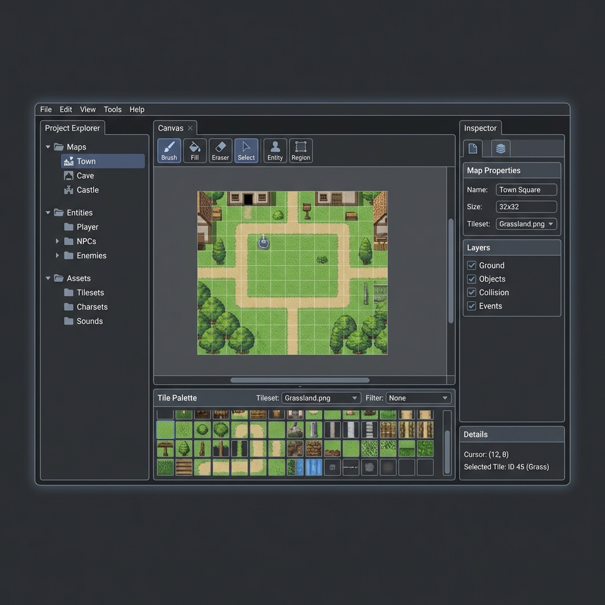

# Wireframe: Editor UI Layout

## Visual Mockup



## Layout Overview

The editor uses a 3-panel layout with the following structure:

### Top Bar
- **Menu Bar**: File, Edit, View, Tools, Help
- **Toolbar**: Drawing tools (Brush, Fill, Eraser, Select, Entity, Region)

### Left Toolbar + Project Explorer (250px default, 200-400px range)
- **Vertical toolbar** (56px): drawing tools + Project Explorer toggle (Ctrl+B)
- **Maps Section**: Hierarchical tree of all maps; first map selected on load
- **Entities Section**: Player, NPCs, Enemies subfolders
- **Assets Section**: Tilesets, Charsets, Sounds subfolders

### Context Panel
- **Tile Palette** when Brush is active (default): tileset of the selected map
- **Entity Palette** when Entity tool is active

### Center Area
- **Canvas Viewport**: Main editing area with grid overlay; renders the selected map

### Right Panel: Inspector (300px default, 250-500px range)
- **Map Properties** (default on load when the project has maps):
  - Name, Size, Tileset
- **Entity Properties** when an entity is selected

## Key Features

### Resizable Panels
- Drag panel borders to resize
- Min/max width constraints enforced
- Panel sizes persist to localStorage

### Hierarchical Navigation
- Expand/collapse folders
- Icons for different item types
- Selection highlighting

### Tile Filtering
- Filter by tag (grass, stone, water, etc.)
- "All" shows all tiles (default)
- "Tagged Only" / "Untagged" options
- Works for both AI-generated and user-imported tilesets

### Contextual Inspector
- Content changes based on selection
- Map properties when map selected
- Entity properties when entity selected
- Tile details when tile selected

## Keyboard Shortcuts

| Shortcut | Action |
|----------|--------|
| B | Brush Tool |
| F | Fill Tool |
| E | Eraser Tool |
| S | Select Tool |
| V | Entity Tool |
| R | Region Tool |
| G | Toggle Grid |
| L | Toggle Layers |
| Ctrl+Z | Undo |
| Ctrl+Y | Redo |
| Ctrl+S | Save |
| Ctrl+N | New |
| Ctrl+O | Open |

## Responsive Behavior

### Desktop (1920x1080+)
- Project Explorer open by default
- Inspector open, Brush active, first map selected
- Full functionality

### Laptop (1280-1920px)
- Project Explorer still open with default panel sizes (space-based rule, ~1246px required)
- Inspector open
- Full functionality

### Small Screens (< ~1246px with default chrome)
- Project Explorer stays closed until the user opens it
- Inspector remains open
- Mobile warning for very small screens

## Implementation Notes

### Technology Stack
- **UI Framework**: Material-UI (MUI) v5
- **State Management**: Zustand
- **Canvas Rendering**: @rpg-studio/core
- **Tree View**: @mui/x-tree-view

### Component Structure
```
EditorLayout
├── ToolBar (vertical, 56px)
├── ResizablePanel (left, open on load if viewport is wide enough)
│   └── ProjectExplorer
│       ├── MapsTree
│       ├── EntitiesTree
│       └── AssetsTree
├── ResizablePanel (context)
│   └── ContextPanel
│       └── TilePalette | EntityPalette
├── MapCanvas
└── ResizablePanel (right)
    └── Inspector
        └── MapProperties | EntityProperties
```

### State Management
```typescript
// editorStore
{
  layout: { leftSidebarOpen, rightSidebarOpen, widths },
  tools: { activeTool, brushSize, opacity },
  selection: { type, id, data }
}

// mapStore
{
  activeMap,
  layers,
  cursorPosition
}

// tilesetStore
{
  activeTileset,
  filterTag,
  selectedTileIds
}
```

## Design Decisions

### Why Tile Palette in the Context Panel?
- Canvas uses full height
- Palette follows the selected map's tileset
- Brush-on-load means the palette is immediately usable

### Why a space-based explorer default?
- A 1920px screen is not the only comfortable size
- Keep a 640px canvas after toolbar + explorer + inspector
- Do not fight the user after they close the explorer

### Why Tools on a Vertical Toolbar?
- Quick access without scrolling
- Explorer toggle sits with the other view/tool controls
- Keyboard shortcuts (B, Ctrl+B, …) remain primary

### Why Optional Tile Tagging?
- Works for both AI-generated and user-imported tilesets
- Enhances organization without being required
- Defaults to "All" filter (shows everything)

### Why Hierarchical Project Explorer?
- Clear organization of game resources
- Scalable for large projects
- Familiar pattern from other editors (Unity, VS Code)

## Future Enhancements (Post-MVP)

- Modular panel docking (VS Code style)
- Save/load workspace layouts
- Multi-monitor support
- Drag-and-drop in project explorer
- Search in project explorer
- Minimap for canvas
- Split views (horizontal/vertical)
